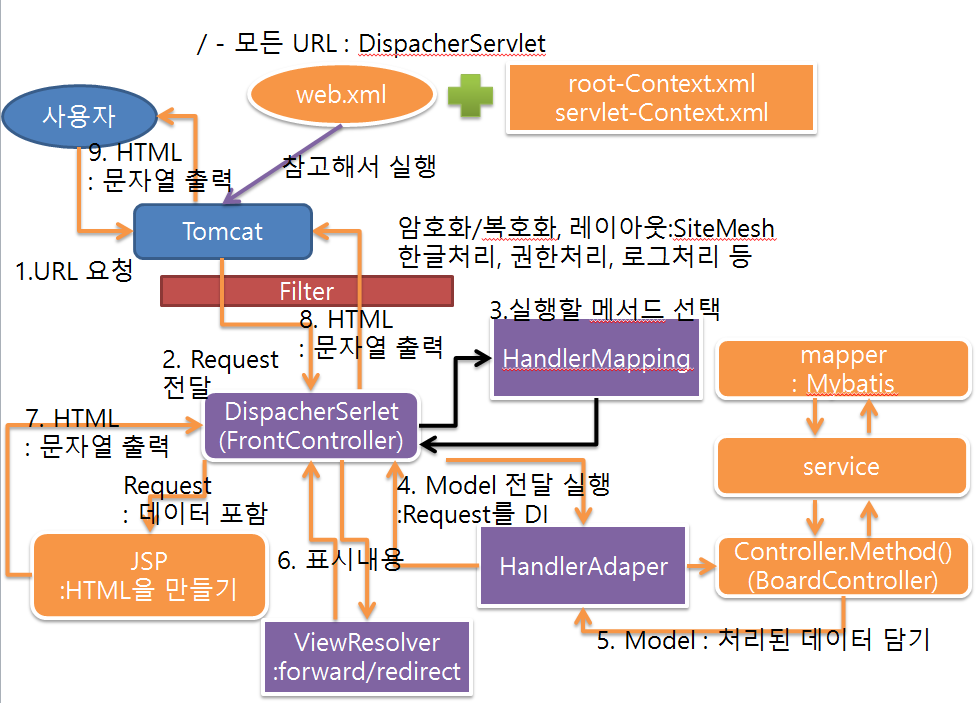

# Spring Framework (Java library)

+ **개발환경**

   

1. **JAVA 8** -> JDK 1.8 : javac 포함
    - 자바 다운로드 : https://oracle.com
    - 기본 설치
    - 환경 설정 : JAVA_HOME, CLASSPATH   
    C:\Program Files\Java\jdk1.8.0_221   
    .;%JAVA_HOME%\lib\tools.jar;   
    path에 추가  
    ;%JAVA_HOME%\bin;
    - 환경설정 확인(명령프롬프트 운영을 위해) :   
    set JAVA_HOME, set CLASSPATH, path, java -version, javac -version   
    
2. **STS(Spring Tools Suite)** 다운로드 설치 -> 긴 파일명이 있으므로 (7zip, 반디집 이용)   
    - 작업 파일 한글 엔코딩 설정 : 기본 euc-kr -> utf-8   
    SpringToolSuite4.ini -> -Dfile.encoding=utf-8 추가   

3. **Tomcat** 다운 설치
    - tomcat.apache.org/download
    - 환경 설정 확인(운영을 위해) : CATALINA_HOME = C:\tomcat9, Path에 %CATALINA_HOME%\bin;
    - oraclexe가 실행되고 있는지 확인해 본다.   
    -> tomcat이 실행되는 포트 : 8080, oraclexe의 웹서비스 포트 : 8080이라 충돌함.
    - 확인 : set CATALINA_HOME, path, startup

4. **Oracle 11g XE** - DB server
    - SID : xe
    - 11g 이하 버전 : 사용자 - 이름
    - 12c 이상 버전 : 사용자 - C##이름
       
5. **SQL Developer** - DB 연결 : 클라이언트 프로그램
    - 다운로드 : https://oracle.com
    - 사용자 생성/권한
    - 사용자로 접속후에 board table 생성

6. **STS 실행**
    - Spring 3.XX. plugin해서 설치한다. -> 재실행 한다.
    - open perspective -> spring 으로 환경을 바꿔준다.
    - Spring Legacy Project를 만들어서 시작 (Spring MVC project)
    - pom.xml에서 java version 변경 1.6 -> 1.8
    - maven -> update project -> servers에서 tomcat등록 후 run server -> "Hello world"

7. **Spring version**변경
    - pom.xml에서 springframework-version을 5.0.7로 수정 -> Maven Dependencies에서 바뀐거 확인.
    - 서버를 돌려서 Hello world가 잘 나오는+지 확인해본다.
    - 문제가 생기는 경우 사용자 폴더에 .m2폴더의 내용을 삭제하고 다시 실행
    
8. **Lombok library**설치
    - DTO를 자동으로 생성해줘서 약간의 코드만으로도 필요한 클래스를 설계할 때 유용
    - Lombok 라이브러리 다운로드 - https://projectlombok.org/download
    - 다운로드 후에 다운로드된 경로에서 cmd로 java -jar lombok.jar 실행
    - 필요한 IDE 선택후 설치 -> IDE 실행위치에 lombok.jar가 들어가 있는지 확인
    - pom.xml에 dependency를 추가
    - sts를 재실행 -> Maven -> update Project
    - @Data -> setter / getter / toString() / 생성자 자동만들기
    - @Setter -> setter를 이용한 DI 적용 
    
9. **DI 테스트**
    - 경고 뜨는거 해결하고 시작(log4j)
    - Lombok라이브러리를 추가하고 spring-test라이브러리를 이용해서 스프링 동작 테스트
    - root-context.xml에 context nampespace를 추가하고 component-scan코드 추가.
    - class를 만들고 src/test/java에서 테스트한다.
    - 자동생성되는 어노테이션 - @Controller, @Service, @Repository, @Component, @RestController
    - lombok 의 @Data @Setter, spring - @Autowired, java - @Inject 이용 
    - Rus As > Junit Test

+ **Oracle 연동**

 

1. **JDBC 연결**
    - Oracle 11g, SQL developer 설정하고 sqldeveloper/jdbc/lib 폴더에 ojdbc8.jar 파일 확인
    - pom.xml에 ojdbc 추가
    - JDBCTests 테스트 코드 작성
    - 커넥션 풀 설정 : pom.xml에 HikariCP를 추가 

+ **MyBatis 연동**

  

1. **라이브러리 추가**
    - SQL mapping 프레임워크로 분류
    - 자동으로 Connection, close() 가능, return 타입을 지정하는경우 자동으로 객체 생성 및 ResultSet 처리
    - pom.xml에 MyBatis 관련 라이브러리를 추가한다. (spring-jdbc/spring-tx/mybatis/mybatis-spring)
    
2. **설정**
    - root-context.xml 설정 : namespace 등록(태그가 생김) ->
    - SQLSessionFactory 설정 -> DataSource 가져 다 설정(Con 연결) -> mybatis 기본패키지 설정 ->
    - interface 와 xml을 연결해서 자동화 프로그램 작성

3. **인터페이스 작성**
    - xml을 이용한 메서드, 어노테이션을 이용한 메서든 선언
    - xml을 이용한 경우 resource 밑에 인터페이스 이름과 똑같은 경로로 xml을 만들어준다.
    - xml은 중복 배제를 위해서 namespace를 설정하고  id는 mapper 인터페이스의 메서드와 맞춰준다.
    
4. **Test 프로그램 만들기**
    - @RunWith, @ContextConfiguration, @Log4j
    - interface 타입의 변수 선언 @Autowire 설정
    - @Test 메서드 선언 -> 인터페이스 메서드 호출

+ **log4jdbc-log4j2 설정**

1. **라이브러리 설정**
    - pom.xml에 log4jdbc-log4j2 라이브러리 추가

2. **로그 설정 파일 추가 및 JDBC의 연결정보 수정**
    - src/main/resources 밑에 log4jdbc.log4j2.properties 파일 추가
    - root-context.xml에서 driverClassName 수정
    

+ **스프링 MVC 흐름도**

+ **스프링 MVC 설정**

1. **한글처리**   
    - pom.xml에서 javax.servlet 버전은 3.1.0으로 바꾸고 web.xml의 web-app 속성을 바꿔준다.
    - 한글처리 : web.xml에 한글처리하는 필터를 추가한다.
    - filter-class : org.springframework.web.filter.CharacterEncodingFilter
    - forceEncoding true 추가

2. **흐름**
    - -> web.xml의 DispatcherServlet(FrontController와 동일)   
      -> @Controller 어노테이션을 이용해서 jsp 주소를 가져오고   
      -> sevlet-context.xml 에서 주소를 조립해서 Dispather로 보여준다.

3. **DAO, DTO**
    - BoardDTO 생성 : @Data를 이용해서 생성자를 자동으로 만들어준다.
    - BoardMapper 인터페이스를 생성하고 resource에 똑같은 위치로 BoardMapper.xml을 만들고
    - namespace를 설정한 후에 select 태그에 id를 list 메서드 이름으로 한 후 쿼리문 작성
    
4. **Service**
    - @Service를 이용
    - @Inject를 이용해서 DI를 자동생성(private으로 변수 만들어줘야함.)
    - BoardMapper 인터페이스를 이용해 만든 list()를 리턴해줄 list메서드를 생성한다.

5. **화면 띄우기**
    - localhost/board/list.do(get) -> 게시판 리스트
    - controller 패키지 안에 BoardController 클래스를 만들고 @Controller 어노테이션으로 자동생성
    - RequestMapping(value = "/board/XXXX.do", method = RequestMethod.GET(POST))로 처리방식 설정해주고
    - request가 들어있는 model.addAttribute(java에서 request.setAttribute와 동일)로 jsp에서 사용할 수 있게 service를 실행해준다.
    - return "board/XXXX" 로 url을 조합할 수 있게 넘겨서 XXXX.jsp를 띄운다.

6. **글쓰기**
    - BoardController에 writeForm()를 만들어주고 return으로 write.jsp로 가게한다.
    - 글쓰기 처리는 Method를 POST로 받으면 처리되게끔한다.
    - write(BoardDTO dto)를 쓰면 title, content, writer를 dto로 자동으로 받아온다.
    - Service, Mapper에 있는 write 메서드에도 dto를 받게 해주고
    - Mapper.xml에서 insert태그를 사용해서 #{title} 등으로 사용하면 글쓰기 처리가된다.
    
7. **글보기**
    - @RequestMapping(/board/view.do)이고 리스트에서 넘긴 no를 view(int no)로 해주면
    - 받아올 수 있다. 그 번호를 가지고 리스트와 똑같이 하되 쿼리에 조건을 붙여서 where no = #{no}
    - 하고 model.addAttribute로 request에 담으면 상세보기가 가능하다.
    
8. **글수정**
    - view를 이용해서 수정할 글이 보이도록 글보기 서비스를 먼저 실행해준다.
    - 글쓰기와 마찬가지로 post로 넘어온 매개변수들을 dto에 받아서 사용한다.
    - Mapper.xml에서는 update태그를 사용한다.

9. **글삭제**
    - 글보기와 마찬가지로 no를 받아와서 Service, Mapper에 만들어주고
    - Mapper.xml에서 delete 태그를 이용해 받아온 no로 where문을 작성해준다.
    - redirect로 list.do로 가게 한다. 

10. **Controller의 return type**
    - String : return type이 String인 경우 return되는 String으로 jsp를 찾는다.
    - void : 호출하는 URL과 동일한 이름의 jsp을 찾는다.
    - ModelAndView : return type ModelAndView 인 경우 return 되는 객체의 데이터로 jsp를 찾고   
     전달되는 데이터를 같이 담아서 넘긴다.
    - VO, DTO, ResponseEntity 등은 Ajax에서 많이 쓰인다.
    - json, xml 데이터를 문자열로 만들어서 @ResponseBody로 보낼 수 있다. 즉, Ajax처리하는 것
    - pom.xml에 jackson-databind 라이브러리를 등록
    - Ajax를 통해서 순수한 데이터를 받아갈 때는 @RestController를 사용한다. 특히, Mobile 앱의 데이터 처리
    - DTO, VO도 마찬가지고 set()을 이용해서 json 데이터를 그대로 넘길 수 있다.
    - ResponseEntity : 데이터와 헤더메시지와 상태코드를 전달할 수 있다.

11. **file upload**
    - pom.xml에 commons-fileupload 라이브러리 추가
    - servlet-context.xml 추가 : 다른 객체를 설정하는 것과 달리 파일 업로드의 경우에   
      반드시 id속성의 값을 multipartResolver로 지정해야하고 fileUpload 설정을 위한 객체를 생성한다.

12. **sitemesh 사용하기**
    - parser를 통해 title, header, body를 분해하고 mapper로 조립하는게 sitemesh
    - pom.xml에서 2.4.2 라이브러리 추가(search.maven.org에서 sitemesh 검색 후 dependency 추가)
    - sitemesh.xml, decorators.xml는 WEB-INF 밑에 추가
    - default_decorator.jsp는 views/decorator 밑에 만든다.
    - web.xml에 sitemesh filter를 선언한다.
